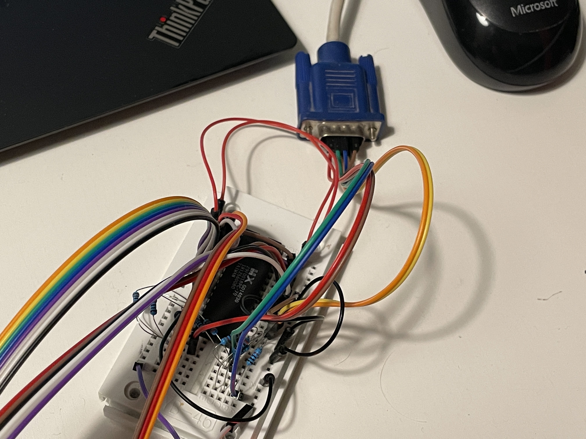

# PHPPLD
PHPPLD provides a simple and easy way to use EEPROMs as a programmable logic device.  

 

The behaviour of the resulting bitstream can be described as a simple PHP script.  
Logical functions like NOT, AND, OR, XOR, etc. as well as more complex address decoding can be done. 
There is also an example script for [generating a 800x600 VGA output](examples/vga.php). (100x600 effective resolution) 

#### Examples
```php
// NOT gate
$output[0] = !$input[0];

// AND gate
$output[1] = $input[1] && $input[2];
```  
results in: 
```
Input 000 - Output 0000 0001
Input 001 - Output 0000 0001
Input 010 - Output 0000 0001
Input 011 - Output 0000 0011
Input 100 - Output 0000 0000
Input 101 - Output 0000 0000
Input 110 - Output 0000 0000
Input 111 - Output 0000 0010
```

__Another example:__ 
```php
$address = integer_value($input);

if ($address >= 0x20 && $address <= 0x40)
{
	$cs_soundchip = 1; 
}
if ($address >= 0x60 && $address <= 0x65)
{
	$cs_videochip = 1; 
}

$output[0] = $cs_soundchip; 
$output[1] = !$cs_videochip; // Note the inversion for active-low signals
```

#### Usage
`php phppld.php -i 17 -w output.bin examples/logic.php`  
generates a bitstream for an EEPROM with 17 address pins [A16:A0] (128 KiB).  

`php phppld.php -i 17 -t 0x30 examples/logic.php`  
shows the result for input 0x30 (decimal values are also accepted).

#### Security notice
__Input files to PHPPLD are PHP source code files which will get executed!__  
They can have any kind of malicious content and do everything a normal PHP script can do.  
Keep this in mind when evaluating third-party PHPPLD files.